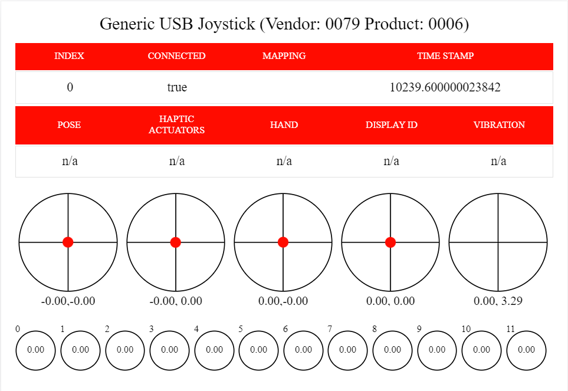

# Gamepad-Controller-Test
Gamepads are often used as replacements for Mouse / Keyboard. While it is not possible to use them with every game, there are several games available that support gamepad controls, especially console ports of PC titles or even games designed for gamepad controls in the first place. To ensure maximum compatibility, Windows uses a default gamepad driver which supports a wide variety of gamepads. The most notable exception is the Xbox controllers, which still use XBCD for their enhanced features (e.g., force feedback). Therefore I have decided to make an easy test for gamers to test their gamepad controller devices on the go online without wasting any time trying to install third-party softwares which are usually out of order on their PCs to get the job done.  This project is inspired by the work of [@greggman](https://github.com/greggman) and tweaks his work a little bit for a better user experience, all credit goes to him for this amazing work and for making my job easy.

## Testing

Test your gamepad on https://gamepadtest.com OR https://online-gamepad-test.stackblitz.io/

